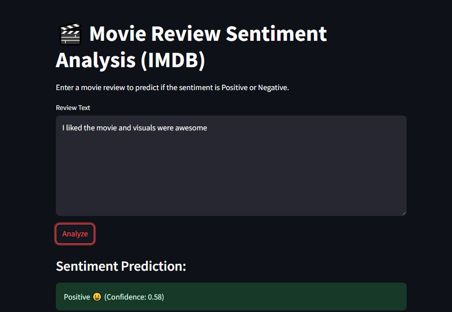

# 💬 Sentiment Analysis using Simple RNN:

A deep learning-based sentiment classification project that predicts whether a review is Positive or Negative using a Simple RNN architecture. The project includes an embedding layer, and features a user-friendly Streamlit web app to input and test reviews interactively.

## 🚀 Project Highlights:

✅ Built using TensorFlow/Keras with Simple RNN architecture

🔤 Includes Embedding Layer to handle text inputs

🌐 Web app interface built using Streamlit for real-time predictions

📊 Trained on labeled review dataset (IMDb/Amazon/etc.)

📦 Easy to run locally with a clean, modular codebase

## 🧠 Model Architecture:

Input Text → Tokenizer → Embedding Layer → Simple RNN → Dense → Output (Positive/Negative)
Embedding Layer: Converts text to dense vector representation

Simple RNN: Learns sequential patterns from the reviews

Dense Layer: Final binary classification (sigmoid activation)

## 🖥️ Web Application (Streamlit UI):

The web app allows users to:

- Enter a custom review

- Click to analyze

- Instantly view whether the review is Positive 😊 or Negative 😞

## 📸 Screenshots:

## 🧪 Tech Stack:

Python 3.11

TensorFlow / Keras

NumPy, Pandas

Streamlit

## ⚙️ Setup Instructions:

- 🐍 1. Clone the Repo

- git clone https://github.com/Shiva-Prasad-Naroju/Review-Sentimental-Analysis-using-SimpleRNN.git

- cd Review-Sentimental-Analysis-using-SimpleRNN

- 📦 2. Create & Activate Virtual Environment (Optional but recommended)

- python -m venv venv

# Windows
venv\Scripts\activate

# macOS/Linux
source venv/bin/activate

- 🔧 3. Install Dependencies

- pip install -r requirements.txt

- 🧠 4. Run the App

- streamlit run app.py

## 📝 Future Enhancements:
Switch to LSTM/GRU for improved performance

Add visual analytics to display confidence scores

Train on larger or domain-specific datasets

